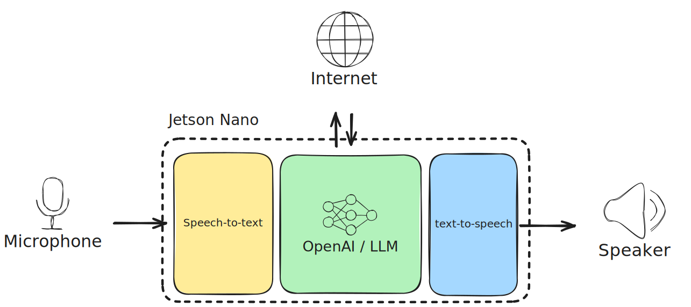

# General-AI-on-Jetson-Nano
<p align="center">
  <a href="https://excalidraw.com/#json=Dwm0GHoietNKHA8DCniZ0,JJ4zQySYlcIwlza8682OVQ">
    
  </a>
</p>


# Tasks
- [ ] [Voice Activity Detection]()
- [x] [Speech To Text]()
- [x] [OpenAI api calling]()
- [ ] [Text To Speech]()
- [ ] [Docker Image]()
- [x] [Test]()
  - [ ] [Test VAD]()
  - [x] [Test STT]()
  - [ ] [Test LLM]()
  - [ ] [Test TTS]()


# How to setup
Copy .env.example to .env, then set environment variables

## set .env
```bash
OPENAI_API_KEY="Place you openai api key here"
VOSK_MODEL=vosk-model-small-en-us-0.15
AUDIO_DEVICE=-1
SAMPLE_RATE=16000
```
## Init project
```bash
make init
```

## Build docker image
```bash
make build
```

## Run docker container
```bash
make up
```

## Show logs
```bash
make logs
```

🚀 Or use simple cmd
```bash
make deploy
```

# How to test
```
make test
```
